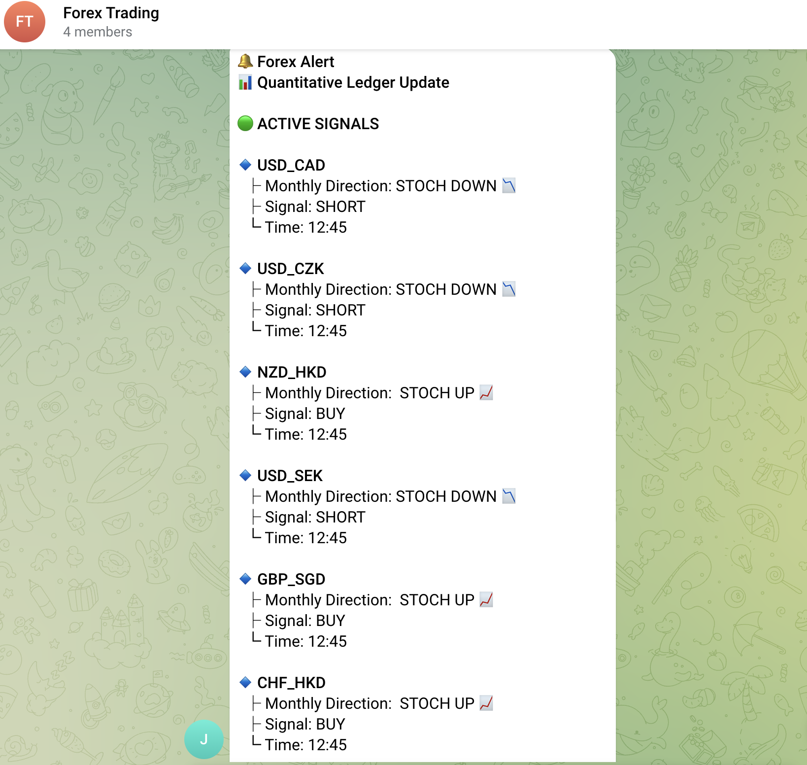

# Forex: Quantitative Trading Engine (v1.3)

A fully automated, multi-threaded algorithmic trading engine built in Python. Designed to interface directly with the Oanda v3 REST API, this system dynamically scans available forex pairs, processes historical market data, and executes a custom Stochastic Bollinger Band strategy across dozens of concurrent threads.

## 🚀 System Architecture & Key Features

* **Modular Strategy Framework (Extensibility):** The architecture utilizes object-oriented polymorphism via a `BaseStrategy` abstract class. The core engine (threading, API clients, and network resilience) is completely decoupled from the trading logic. This plug-and-play design allows for rapid deployment of new quantitative models (e.g., Mean Reversion, Statistical Arbitrage) simply by subclassing the base strategy, without ever touching the core execution loop. Future roadmap includes deploying additional momentum and volatility-based strategies.
* **Producer-Consumer Dispatcher (v1.3 Upgrade):** Solved "Thundering Herd" API rate limits. Strategy threads (Producers) now silently write state changes to the database. A centralized Master Dispatcher thread (Consumer) monitors the DB and batches multiple pair updates into a single Telegram broadcast, preventing API bans and network noise.
* **Persistent SQLite Ledger (v1.3 Upgrade):** Upgraded from volatile RAM state to a robust SQLite3 database using WAL (Write-Ahead Logging) mode and thread-locking. Ensures flawless crash recovery, highly concurrent thread safety, and perfect reconstruction of both live and historical trade data on server boot-up.
* **Concurrent Execution:** Utilizes memory-isolated OS-level threads to monitor up to 70+ currency pairs simultaneously without blocking the main execution loop.
* **API Resilience & Rate Limit Handling:** Implements exponential backoff and randomized execution jitter to gracefully handle HTTP 429 (Too Many Requests) errors.
* **Dynamic Market Scanning:** Automatically queries the broker on boot to map available instruments, adapting instantly to broker-side additions or removals.
* **Precision Time Synchronization:** UTC-anchored sleep scheduling ensures the engine idles efficiently and wakes up at the exact millisecond of the 15-minute and 4-Hour candle closes.
* **Asynchronous Telegram Broadcasting:** Built-in integration to broadcast real-time signals, technical breakouts, and structured ledger updates (with trend directions and timestamps) directly to a Telegram group.
* **Stateless Actuators & Weekly Logging:** Database and notification clients are engineered as strictly stateless services, eliminating the need for complex thread-locking (Mutexes) in the logic. Implements `TimedRotatingFileHandler` with isolated, weekly-rotating (`W0`) logs for every currency pair.


## Directory Structure

    Forex/
    │
    ├── Core/
    │   ├── indicator.py        # Mathematical formulation for Bollinger Bands & Stochastics
    │   ├── ledger.py           # Thread-safe SQLite database manager
    │   ├── oanda_client.py     # Resilient HTTP client for the Oanda v3 API
    │   ├── smsNotifier.py      # Telegram API broadcast engine
    │   └── visualizer.py       # Data visualization and charting tools
    │
    ├── strategies/
    │   ├── base_strategy.py    # Abstract base class & Weekly Log Rotation
    │   └── stoch_bollinger.py  # Primary state-machine trading logic
    │
    ├── Logs/                   # Auto-generated weekly logs and .db files (Git Ignored)
    ├── tests/                  # Unit tests and API connection verifications
    ├── main.py                 # The Thread Spawner & Master Dispatcher
    ├── requirements.txt        # Python dependencies
    ├── .gitignore              # Security and environment exclusions
    └── README.md


## ⚙️ Installation & Setup

**1. Clone the repository**
```bash
git clone [https://github.com/JackShkifati28/Forex_Trading_Strategies.git](https://github.com/JackShkifati28/Forex_Trading_Strategies.git)
cd Forex_Trading_Strategies

**2. Create a virtual environment and install dependencies**
```bash
python3 -m venv .venv
source .venv/bin/activate  # On Windows use: .venv\Scripts\activate
pip install -r requirements.txt
python main.py 
```

**3. Environment Variable Configuration**
Create a `.env` file in the root directory. This file is explicitly ignored by Git to protect your API keys.

```text
# .env
API_TOKEN=your_oanda_v3_api_token
ACCOUNT_ID=your_oanda_account_id

# Telegram Broadcasting Setup
TELEGRAM_API_TOKEN=your_telegram_bot_token
GROUP_ID=your_telegram_chat_id
```

## Strategy: Stochastic Bollinger Ping-Pong
This engine currently runs a custom state-machine strategy designed to filter out market noise during heavy trends. 

**1. The Macro Filter:** The engine monitors the Monthly timeframe for macro momentum direction.


**2. The 4H/15m Trigger:** On the 4-Hour timeframe, the bot tracks complete traversals of the Bollinger Band channel. It strictly executes on the *first touch* of the opposing band that aligns with the macro momentum, inherently ignoring subsequent touches (market "hugging") until the price physically resets by crossing the entire channel again.


## The Telegram Dispatch UI
When the Master Dispatcher detects a newly completed channel traversal that aligns with the macro trend, it batches the updates into a clean ledger card:



## ⚠️ Disclaimer

**This software is for educational and research purposes only.** Do not risk money which you are afraid to lose. USE AT YOUR OWN RISK. The authors and contributors assume no responsibility for your trading results. Always test algorithmic strategies on a paper-trading/demo account before deploying live capital.
